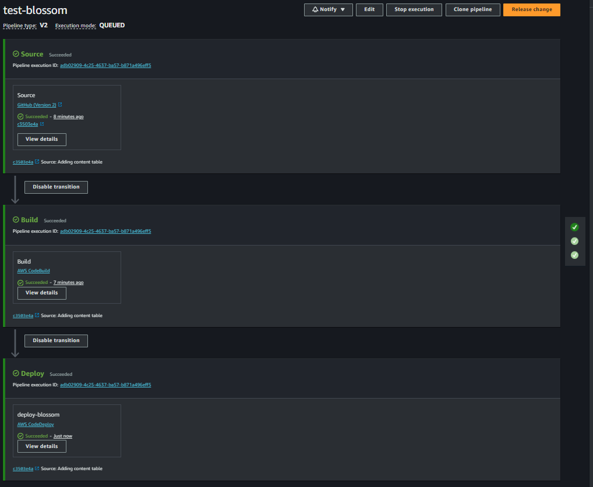

# Readme to explain the structure of the project and how to use it


* [Used technology](#tech)
* [Repository](#repo)
* [Domain-based structure](#domain)
* [Application YAML](#application-yaml)
* [Dockerfile](#dockerfile)
* [Buildspec file](#buildspec)
* [Appspect file](#appspec) 
* [Liquibase folder](#liquibase)
* [SWAGGER Documentation](#swagger)
* [AWS Infrastructure](#aws)
* [Theoretical questions](#theoretical-questions)
* [Evidences CI/CD deployment](#evidences-ci-cd-deployment)


<a name="tech"></a>
## Used Technology

**Framework SpringBoot:** Hibernate, JPA, Validation, Web
**Dependency management:** Maven
**Other libraries:** Lombok, MapStruct and AWS SDK

<a name="repo"></a>
## Repository
Clone the repository
```bash
  git clone https://github.com/adreso/test-blossom.git
```
Install the dependencies
```bash
  ./mvnw clean install
```
Start the server
```bash
  ./mvnw spring-boot:run
```

<a name="domain"></a>
## Domain-based structure

The Driven Domain Design (DDD) approach is applied.

**IMPORTANT:** The application and domain layers should not implement any class from the infrastructure layer; while the infrastructure layer can implement classes from the domain.

Project Structure
```bash
  ├── java
  │   └── co.com.blossom
  │       ├── configs                                # Configuration files for the application
  │       │   ├── annotations                        # Custom annotations especially for the exception handling
  │       │   ├── aspects                            # Aspect classes for the application to handle the exception
  │       │   ├── controller                         # Abstract controller class to standardize the responses
  │       │   ├── enumerators                        # Enum classes to cross the application
  │       │   ├── exceptions                         # Exceptions classes to capture the error through the aspects in the different part of the application (Infrastructure, Application, Domain)       
  │       │   ├── infraestructura                    # Properties files for the application
  │       │   ├── utils                              # Standar response, custom slice to paginate, error codes and environment properties
  │       ├── AppConfig                              # Define the confugurations that affect the entire application
  │       ├── service1                               # Group of folders containing the all the domains of the application
  │       │   ├── domain1                            # This is a group of folders that contains the structure of the domain
  │       │   │   ├── application                    # The application layer of the domain
  │       │   │   │   └── rest                       # In this case the application layer is a rest controller
  │       │   │   │       └── ...Controllers         # The rest controller class. Ex. TemplateController.java
  │       │   │   ├── domain                         # The domain layer of the domain
  │       │   │   │   ├── gateways                   # The interface of the domain to communicate with the infrastructure
  │       │   │   │   ├── model                      # The DTO and the projection of the domain
  │       │   │   │   └── services                   # The interface and implementation of the domain to communicate with the application
  │       │   │   └── infraestructure                # The infrastructure layer
  │       │   │       └── mysql                      # In this case the infrastructure layer is a mysql database
  │       │   │           ├── gateways               # The implementation of the domain to communicate with the infrastructure
  │       │   │           ├── mapper                 # The mapper to convert the DTO to the entity and vice versa
  │       │   │           └── model                  # The infrastructure entity to communicate with the database
  │       │   │           └── ...Repository          # The repository to communicate with the database
  │       │   └── domain1                            # Other domain of the application
              . . .
  │       ├── service2                               # Other group of folders containing the all the domains of the application
  │       ├── service3                               # Other group of folders containing the all the domains of the application
  
```
The test structure is the same as the main structure, but the test classes are in the same package as the class to be tested.

<a name="application-yaml"></a>
## Application YAML
In the application YAML file we have all the configurations and environment properties for the application. And this is ubicated in the resources folder.

```bash
  ├── resources
  │   └── application.yml
```
For this file in particular we are using a configuration based in profiles, specifically to work with aws parameters store. To work with multiple environments we have to create a profile in the application.yml file and create a file with the same name of the profile and the properties that we want to override. For example, if we have a profile called dev, we only need to add that profile and create the parameter store environment variables in the aws console.

<a name="dockerfile"></a>
## Dockerfile
In this file we have the configuration to build the application in a docker container. This file is ubicated in the root of the project.
```bash
  ├── Dockerfile
```
For this file in particular we are using layers to optimize the build of the application, but there this still can be more optimized.

<a name="buildspec"></a>
## Buildspec file
In this file we have the configuration to build the application in AWS CodeBuild. This file is ubicated in the root of the project.

```bash
  ├── buildspec.yml
```
For this file in particular we are defining three phases: install, pre_build and build. 
    - In the install phase we just definite the runtime version
    - In the pre_build phase we are testing and installing the application to generate the jar file
    - In the build phase we are building the docker image and pushing it to the ECR repository
    - Finally we are generating the imagedefinitions.json and the appspec.yml files to deploy the application in AWS ECS.
``
For the tests in particular, we could have created a new phase called test and run the tests in that phase, but for this case we are running the tests in the pre_build phase, for simplicity.
``

<a name="appspec"></a>
## Appspect file
In this file we have the configuration to deploy the application in AWS ECS. This file is ubicated in the root of the project.

```bash
  ├── appspec.yml
```
In this case we are only defining the task definition and the container name to deploy the application in AWS ECS. This can be more dynamic, but for this case we are using a static configuration.

<a name="liquibase"></a>
## Liquibase folder
In this folder we have the configuration to manage the database changes. This file is ubicated in the root of the project. More information about the structure of the liquibase folder can be found in the readme.md file in the liquibase folder.

<a name="swagger"></a>
## SWAGGER Documentation
This is the URL to access the swagger documentation of the application. This is a dynamic documentation that is generated from the application through the annotations in the rest controllers.

[https://dev-ms-blossom-private.testfacte.com/blossom-app/swagger-ui/index.html#/](https://dev-ms-blossom-private.testfacte.com/blossom-app/swagger-ui/index.html#/)

<a name="aws"></a>
## Diagrams
In the diagrams folder we have the diagrams of the application. This file is ubicated in the root of the project.

```bash
  ├── diagrams
  │   └── diagrams.png
```


For the AWS infrastructure for this application, there is a tiny explanation of the resources created in the AWS console. The resources created are the following:

1. **Load Balancer**: In this case in particular, we create a load balancer with a listener in the secure port 443 with a rule in a path pattern /blossom-app/* to forward to the target group created associated to the ECS.
3. **ECR**: We create the ECR to upload the docker image, for this occasion we don't activated the immutability tag to be more practical and always push with the latest Tag 
2. **Task Definition**: In this case, we select a launch type AWS Fargate with a task size 1vCPU and 2 GB memory. 
In this task we define the container details with the ECR previously created and the Tag latest, we also configure the container port on 8081. Even in this part, we configure the log output to be saved in CloudWatch
4. **Services**: With the created task, we run our Server, we defined the desired tasks and the deployment options to be used in the CI CD pipeline also in this part we configure our listener. And in case we need, we can configure the autoscaling policy. 
5. **RDS**: We created a schema named TESTS to work for this project, this is using aurora.
6. **Cloudwatch**: The output of the logs were configured in the task definition.
7. **Route 53**: The subdomain dev-ms-blossom-private was created with a domain previously created with Route 53 and is attached to the DNS Load Balanacer.
8. **Cognito**: The authentication part with JWT were integrated with Cognito, Congnito in this case handle all the part of the users, the authentication, and authorization, all this generating a token with all the enough claims to work. Using Cognito we register the user, this send a code to the email to confirm the user, and then the user can log in with the email and password.
9. **Lambda**: In this case the lambda is triggered for Cognito when the user is checked, so at the moment when the token is about to be created this add some additional claims like in this case the role, to be used for the application.
10. **Pipeline**: This contains all the logic for the CI CD
11. **Source Stage**: This stage connects to GitHub through a token Authorization configured in the GitHub account, this trigger the pipeline in this case when the User push to the Main.
12. **Build Stage**: For this case, we are using CodeBuild, this download the source code and execute the buildspec.yml defined stages in this file:
     - Execute the tests
     - Install the dependencies and generate the jar
     - Generate the Docker image
     - Push the Docker image to the ECR
 at the end of this process this creates a .zip artifact with the information of the image definitions(imagedefinitions.json) and the appspec.yml
13. Deploy Stage: In this part of the process we are using CodeDeploy, this get the artifact generated for the CodeBuild and with this information and the configured ECS with its tasks, target group, load balancer, etc. this have the enough information to deploy to upload the task definition and update the service to run new task with the new docker image

#### _There are several things we could have done to improve this process, but due to time and speed, they may not have been accomplished, which I will mention below:_
- I could have used a system Cache like Redis to store the Token and repeated requests to improve the user experience.
- In the implementation of all infrastructure like the Load Balancer, ECR, Services and Task and part of the CI CD I use the CDK with Python to create these resources, but there is some configuration in the CI CD I make manually, directly from the console to speed up the development process, with enough time we could have all the infrastructure as code, and we could use this to be able to use in the future in other projects.
- In the ECS services there is not autoscaling implementation, this is an easy one, but I consider this is not important in this case taking into account there is no load tests to check out the performance of the application.
- We could think ahead, and separate the project into microservices and have an inventory microservice and another for ordering, for example
- The use of the Refresher token is not implemented, this is a good practice to have a more secure application, but for this case, we are using the token with a short expiration time, because time.
- The lambda to add the role to the token was not implemented, I was an idea without time to implement it, but the idea was to have users with different roles and permissions, so the application could have different behaviors depending on the role of the user.

#### _Some of the problems encountered while creating the application were:_
- When creating the CI CD, I had a lot of time without doing this, so I forgot to add some permissions to the CodeBuild to be able to push the image to the ECR among other permissions, I expend a lot of time figuring out what was wrong, because the output error don't give me much detail, but after a while I was able to solve it.
- Another difficulty I had was with the rules of the Load Balancer, I created the Load Balancer with a CDK previously created for me a time ago, so I create a rule to forward the traffic to the target group, I change the path in my application to add actuator for the health of the application and I only change the health check in the target group, but I forget to change the rule in the Load Balancer, so I expend a lot of time figuring out what was wrong, but after a while I was able to solve it.
- I exceded the Docker quota to pull images when doing the CI/CD, so I just create a public ECR to push the **AmazonCorreto** image and pull it from there
- In general, I don't have too much problem creating the application, maybe I miss some time to do more thing to demonstrate more of my skills and knowledge, like implementing X-Ray, but I think I did a good job.


<a name="theoretical-questions"></a>
## Theoretical questions
**Describe how and why you would implement the Repository design pattern in this application.**

The general idea with this pattern is to have a generic, abstract way for the app to work with the data layer without being bother with if the implementation is towards a local database or towards an online API.
This pattern design gives the possibility to enhance flexibility, enabling the application for example to adapt the data to various data sources without requiring significant modifications to its core logic.
This Adaptability is very beneficial for enterprises dealing with ever-changing business requirements and diverse environments. This also helps to integrate new data sources without disrupting existing functionalities, promotes maintainability and scalability, and promotes the unit testing of the application.
So, adopting this pattern is a future-proofing strategy in enterprise applications.

**Explain how Spring handles dependency injection and why it is beneficial for the
development of enterprise applications.**

Dependency injection is facilitated by spring through its Inversion of Control, that is a central component that manager the instantiation and wiring of application objects, this components are independent and can be easily modified or replaced without affecting the rest of the system. So this encourage modular design allowing developers to break down complex systems into smaller manageable parts. This simplifies a lot the maintenance and promotes code that is easier to understand and debug. Furthermore, this allow make changes with minimal effort and promotes the unit testing of the application.

**Discuss the differences between JPA and Hibernate, and why you would choose one over  the other.**
The main difference between JPA and Hibernate is that JPA is a specification that defines the management of relational data in Java applications, while Hibernate is an Object-Relational Mapping (ORM) framework that implements the JPA specification.
So in general, I would choose Hibernate if I need advanced ORM features with a lot of flexibility and JPA if I need to be able to switch between different ORM frameworks or reduces the interactivity with the database.

<a name="evidences-ci-cd-deployment"></a>
## Evidences CI/CD deployment 

